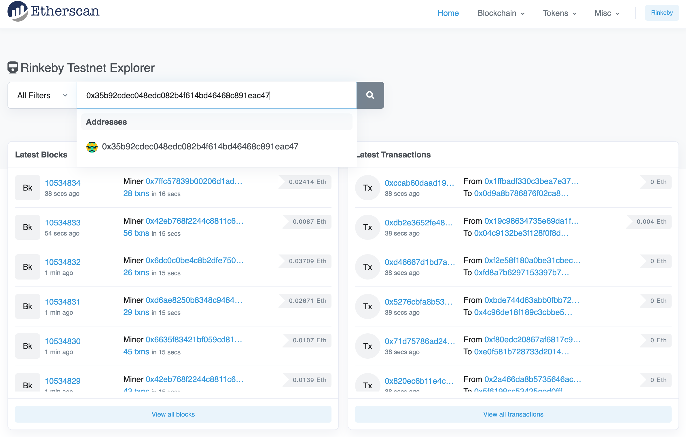
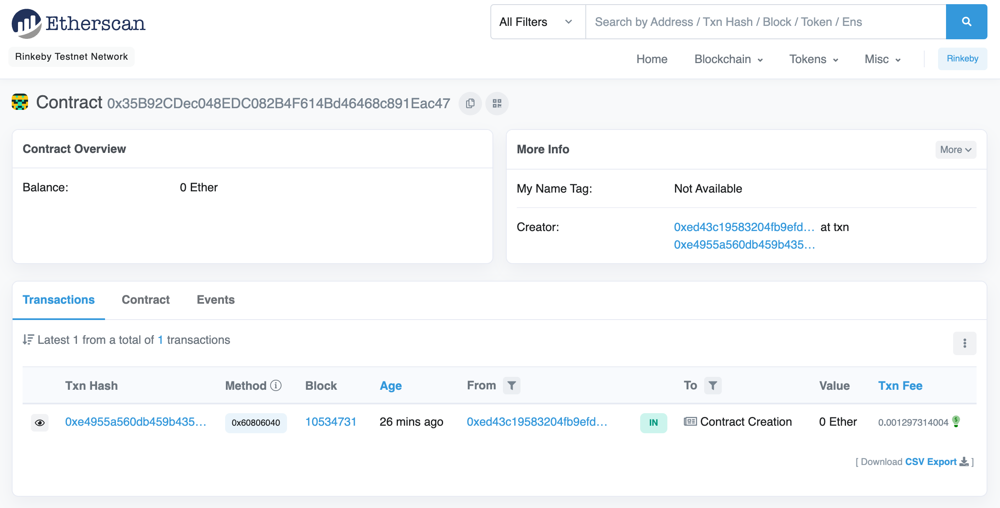
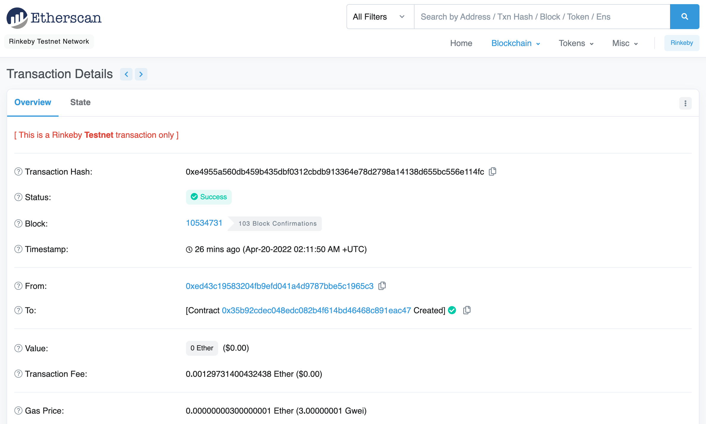

# Deploying the contract

We can use the `forge create` command to deploy a compiled contract. We'll need to pass Forge the RPC URL and private key we generated as parameters, as well as the name of our contract:

```bash
$ forge create \
--rpc-url https://eth-goerli.g.alchemyapi.io/v2/<API key> \
--private-key 61bc97eb39d98d3103ec4d107906575189f1c7dbebbddcb400a6cccb72e65c53 \
TicTacToken
[⠊] Compiling...
No files changed, compilation skipped
Deployer: 0xed43c19583204fb9efd041a4d9787bbe5c1965c3
Deployed to: 0x35b92cdec048edc082b4f614bd46468c891eac47
Transaction hash: 0xe4955a560db459b435dbf0312cbdb913364e78d2798a14138d655bc556e114fc
```

> **Key management**
>
> Passing a private key directly on the command line is a quick and dirty way to deploy our work in progress, but it's not recommended for a serious deployment. Foundry supports a number of other, better methods for securely accessing a private key, including hardware wallets, mnemonic phrases, and an encrypted keystore file. Pretty much any of these are better options.

Notice that Forge printed our deployer account address, as well as the address of the newly deployed contract and the hash of the deployment transaction.

We should be able to see our newly deployed contract on [Etherscan](https://etherscan.io/), a tool for exploring contracts, accounts, and transactions on Ethereum and test networks. Visit the Görli explorer at [https://goerli.etherscan.io/](https://goerli.etherscan.io/) and enter our contract address:



You'll see some information about the deployed contract: the creation transaction, the address that deployed it, and its balance in (Görli) ether:



Click on the link under "Txn hash" to see details of the deployment transaction:



Just one more setup step before we interact with our contract: verifying the source code on Etherscan.
