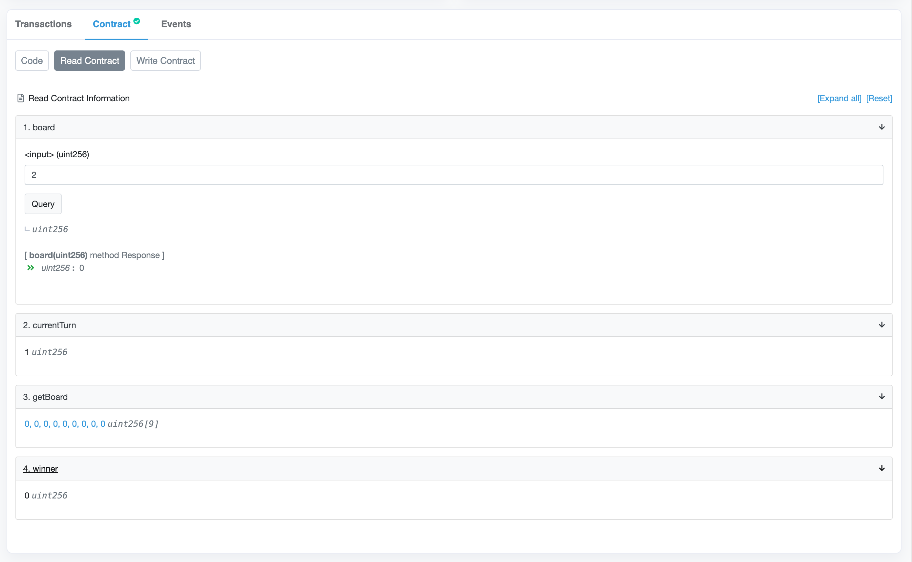
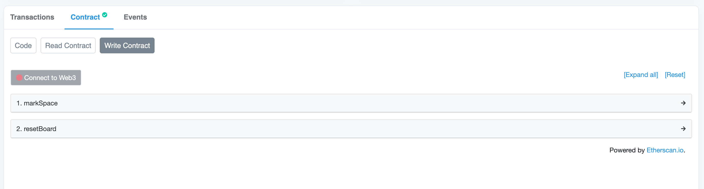
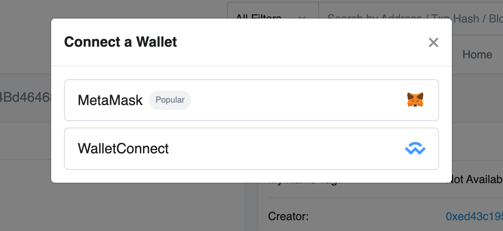
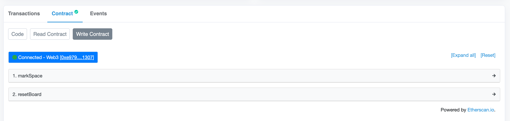
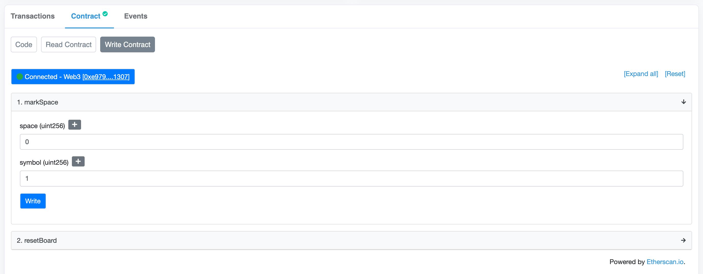
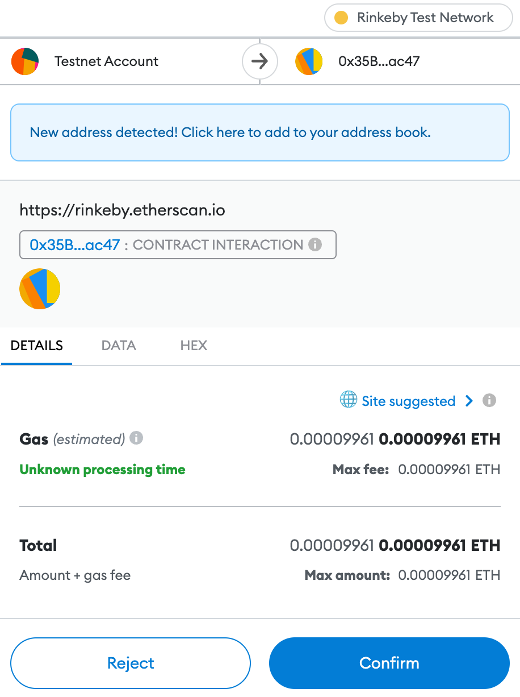
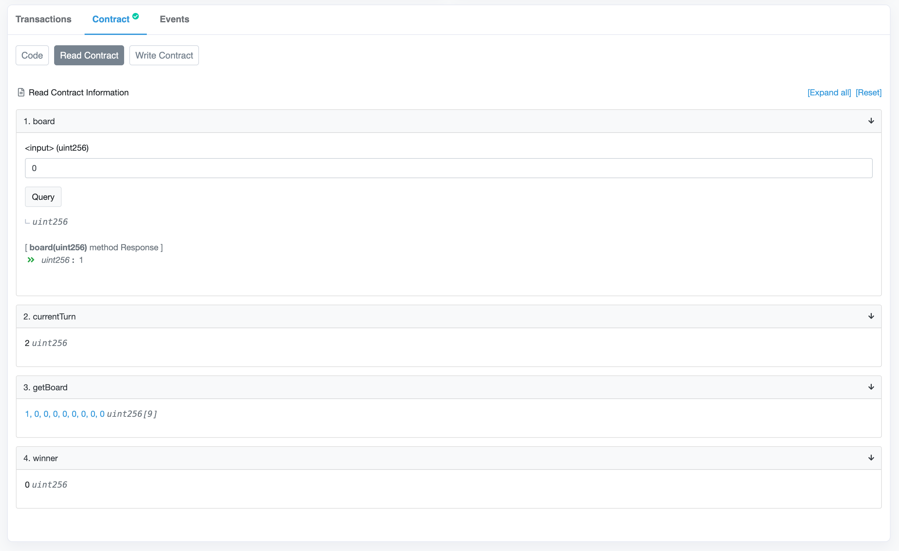

# Exploring the basic board contract

Now that our contract is verified on Etherscan, we can read its source code and even interact with it from the Etherscan interface.

Under the "Read Contract" tab, we can read data like public state variables and call view functions. Notice how the `board` function exposes the default getter? We have to provide an index and press the "Query" button to read a value from our contract.

The `currentTurn`, `getBoard`, and `winner` functions are all views that take no arguments, so Etherscan shows their values directly.

Looks like everything we should expect: an empty board array full of zeros, X's turn by default, and no winner yet.

Want to see something even cooler? We can _interact_ with our contract under the "Write Contract tab.

> **Safely using Write Contract**
>
> Be extremely careful with Etherscan's "Write Contract" feature. Using this should always feel a little dangerous, because it is! It's a good idea to use a separate, isolated wallet and account to interact with testnet contracts.
>
> Never, ever write to a contract on Etherscan that you don't trust or understand.

To interact with the contract, first click the "Connect to Web3" button on the "Write Contract" tab:

Follow the prompts to connect a wallet:

Once you're connected, you'll see a green indicator and the address of your connected account:

From here, we can call functions on our contract! Let's marke the first space with an "X", by entering space 0 and symbol 1:

Remember that state changing transactions cost gas and require payment in (testnet) ether. Pressing the "Write" button will prompt your connected walled to confirm the transaction, and we'll need a sufficient ether balance in our wallet in order to send the transaction and execute the function call. Here's what the prompt looks like in Metamask:

If you're following along and need Rinkeby ETH, you can request it from the [Paradigm faucet](https://faucet.paradigm.xyz/) to your wallet address just like we did when we funded the deployer account.

Watch for a notification from your wallet that the transaction is confirmed. Depending on how busy the testnet is, it may take a few seconds to a few minutes for your transaction to be mined and confirmed.

Once it's confirmed, we can return to the "Read" tab and see the new state of the board. Sure enough, it's now player O's turn and the first square is marked:

Try this out for yourself! Send a few test transactions and see what happens to the board state. If you connect a row, does the board detect a winner? What happens if you make an invalid move and trigger a `require` statement?

In addition to our existing board code, I've added a `resetBoard` function that will clear the board. Call this if you need to reset the state.
