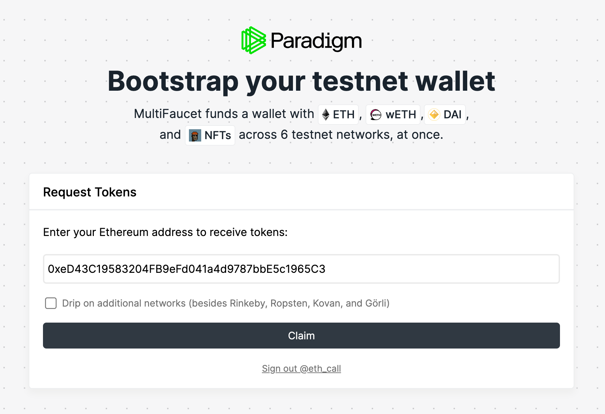

# Funding the deployment address

In order to deploy our contract to Rinkeby, we first need to fund our account with testnet ether. This is the equivalent of ETH on mainnet: the asset we need to use to pay for gas. Before we can deploy or interact with a contract, we'll need some Rinkeby ETH.

Test networks typically provide testnet ether for free via a faucet. (In order to prevent abuse, many ask you to solve a CAPTCHA or log in with a Twitter account). We'll use the [Paradigm multifaucet](https://faucet.paradigm.xyz/) to fund our deployer account with some Rinkeby ether.

Log in with a Twitter account, enter the address of our deployer account, `0xeD43C19583204FB9eFd041a4d9787bbE5c1965C3`, and click "Claim" to request Rinkeby ether:

You'll see a confirmation notification pop up, and should recieve test ether at the deployer account address within a few minutes.
