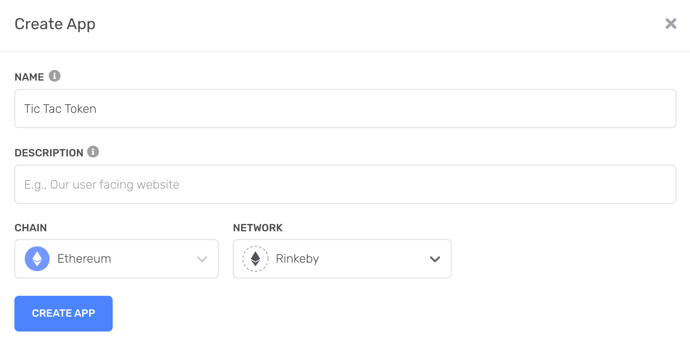
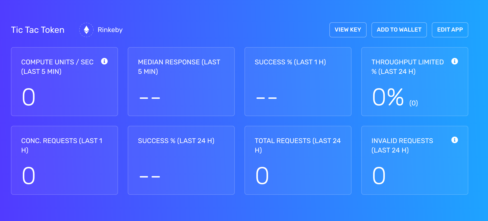

# Setting up an RPC endpoint

Finally, we need to connect to an Ethereum node in order to transmit our contract deployment transaction to the network. Ethereum clients like Geth, Nethermind, and Erigon expose a [JSON-RPC API](https://eth.wiki/json-rpc/API) that allows applications to send transactions, read data, and otherwise interact with the network.

Rather than running our own node and connecting to it locally, we'll use [Alchemy](https://www.alchemy.com/), an Ethereum-node-as-a-service provider that provides RPC access over the internet.

Once you've signed up for an Alchemy account, create a new app on the Ethereum chain and Rinkeby network:

Once it's set up, visit the app from the dashboard, select "View Key," and copy the HTTP URL:

The URL should looks something like `https://eth-rinkeby.alchemyapi.io/v2/<API key>`. We'll pass this to Foundry to allow it to send transactions and read data from the Rinkeby network.

With our address, some test ether, and an RPC endpoint in hand, we're finally ready to deploy our contract...
