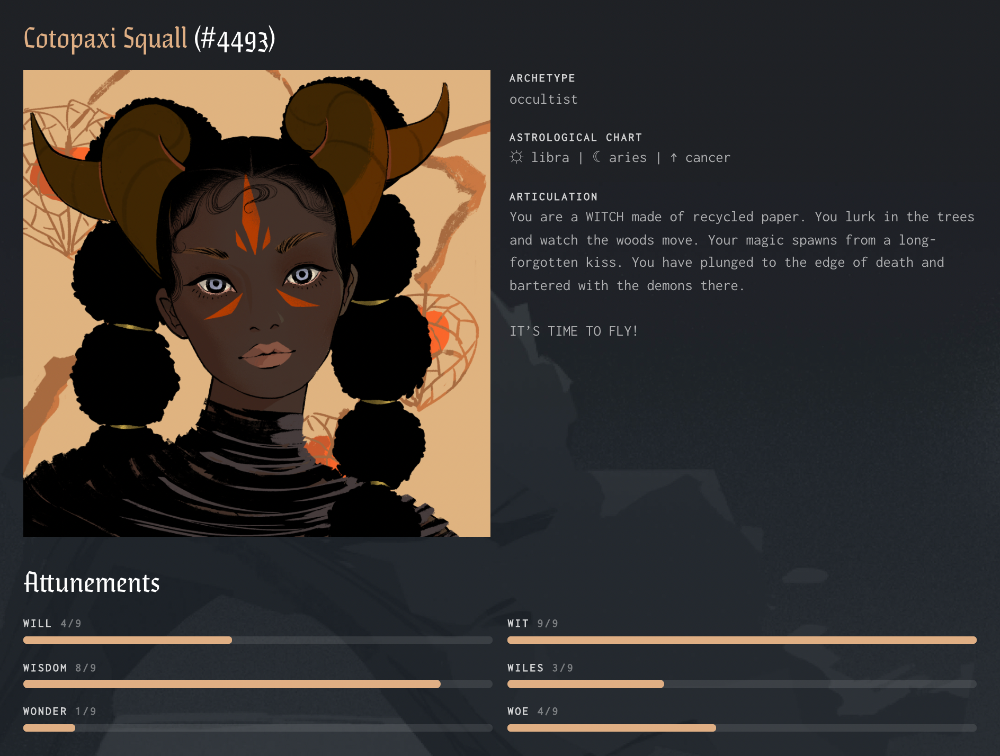

# Exploring a token

Reading the interface is all pretty abstract and boring. Let's look at a real token instead. This is Cotopaxi Squall, a [Crypto Coven](https://www.cryptocoven.xyz/witches/4493) witch:

This token has ID #4493, indicated next to her name. However, the rest of the rich, interesting information about Cotopaxi comes from her metadata: a name, description, unique image composed of multiple layers and attributes, archetype, RPG-style stats, and even an astrological chart!

Let's work our way back to the contract and its metadata. Here's the Crypto Coven contract on [Etherscan](https://etherscan.io/address/0x5180db8f5c931aae63c74266b211f580155ecac8).
