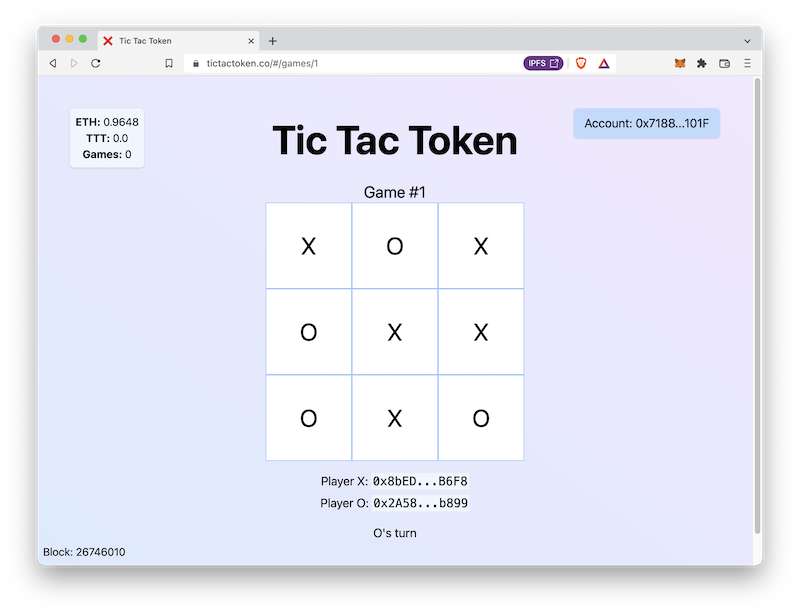

# Introduction

Over the course of this curriculum, we'll learn the basics of Solidity and Ethereum from the ground up by creating an interactive web3 Tic-Tac-Toe game. We'll learn to write and test Solidity smart contracts using Foundry and Hardhat. We'll learn about ERC20 tokens, NFTs, and other Ethereum abstractions. We'll create a React frontend using useDapp and Ethers and deploy it to IPFS, a distributed peer-to-peer filesystem. Finally, we'll deploy our smart contracts to Polygon, an EVM-compatible blockchain with fast, cheap transactions.

The content in this book was originally written as a supplement to a series of hands on workshops. We typically cover one chapter per week, with two one hour sessions dedicated to writing code collaboratively using [Live Share](https://code.visualstudio.com/learn/collaboration/live-share).

## Prerequisites

You should have some experience programming to get the most out of this content, but you don't have to be an expert. Here are a few suggested prerequisites. 

- You've read chapters 1-6 of [Mastering Ethereum](https://github.com/ethereumbook/ethereumbook) to get a basic understanding of Ethereum.
- 101 level React: You've created a basic React application. You should be familiar with create-react-app, hooks, structuring an app, and basic testing.
- 102 level automated testing: You've written automated tests before. You should be comfortable writing unit tests and using xUnit style assertions. 
- 102 level UNIX: You're not afraid of the terminal. You should be familiar with Make, bash, and working on the command line.
- 201 level polyglot programming: You've used both a dynamic language like JS/Python and a typed language like Java/Golang.
